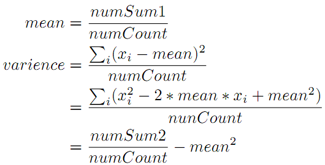

# SimpleMapReduce
A simple MapReduce framework

&emsp;因为``MapReduce``是基于``DFS``的，所以这里的简单``MapReduce``是在前面实现的一个[简单的DFS框架](https://github.com/ShowLo/SimpleDFS)上进行修改得到的。

&emsp;``MapReduce``的主要思想是将对大规模数据集的操作分发到由主节点``master``管理下的各个分节点``slave``共同完成，然后通过整合各个节点的中间结果得到最终结果。在``DFS``的``master``中，运行着``JobTracker``，在``slave``中运行着``TaskTracker``，``JobTracker``用于调度工作而``TaskTracker``用于执行工作。

&emsp;在此``MapReduce``框架中，对前面``DFS``框架的``master``做修改得到``JobTracker``，类似地，对前面``DFS``框架的``slave``做修改得到了 ``TaskTracker``。其中``JobTracker``与前面``DFS``中的``master``的区别主要在于其接收了由客户端传过来的文件并进行了分块和分发的工作之后，需要给每个分块指定一个``Mapper``（这里的``Mapper``的意义要比原先的略为广泛，还包括了``shuffle``过程），调度``TaskTracker``执行``Mapper``依次对分块进行``map``操作、``combine``操作（相同``key``值进行合并）和``shuffle``操作（``hash(key) % reducerNumber``），将``Mapper``的输出结果存于``slave``中作为中间结果文件。其中，根据本地计算的思想，我们总是把一个与分块对应的``Mapper``交由拥有此分块的``slave``上的``TaskTracker``，以避免从其他``slave``传输分块。进行完``Mapper``操作之后，对应于每个分块我们得到了若干个中间结果文件（其数量取决于``Reducer``的数量），``JobTracker``根据用户给定的``Reducer``数量在多个``slave``上的``TaskTracker``中随机选择若干个作为即将执行``Reducer``的``TaskTracker``，然后调度各个``TaskTracker``从其他``slave``中将对应于某个``Reducer``的中间结果文件发送到此``Reducer``所在的``slave``上，再由``JobTracker``通知``TaskTracker``执行``Reducer``，得到最终结果（一个``Reducer``对应一个结果文件）。完成``Reduce``工作之后，``JobTracker``会调度``TaskTracker``删除中间结果。

&emsp;这里以实现均值和方差统计功能为例，``Mapper``中的``map``操作为：对应一个输入`x`（即为一个数），包装成``{x : 1}``的形式输出。``combine``操作会将相同的``x``组合到一起，即形成``{x : [1, ... , 1]``的形式，``shuffle``操作对``key``进行``hash(key) % reducerNumber``的操作，从而对应于一个分块文件，得到了``reducerNum``个中间文件（``reducerNumber``为``Reducer``的数目）。``Reducer``中的``reduce``操作为：对于属于自己处理的所有中间结果块，遍历各个``key``，取出对应的``value``（一个列表），对``value``中所有元素累加得到的是对应``key``的个数（也就是``key``这个数出现了几次）并累加到``numCount``中去，同时将``key``与其个数相乘然后累加到``numSum1``中去，将``key``的平方与其个数相乘然后累加到``numSum2``中去，那么最终``numCount``得到的就是数的个数，``numSum1``得到的就是数的总和，``numSum2``得到的就是数的总平方和。因为可能有多个``Reducer``，所以还需要将多个结果文件取回到本地，然后将``numCount``、``numSum1``和``numSum2``各自累加得到最终的所有数的个数、总和以及总平方和，最后根据

即可得到所有数的均值``mean``和方差``variance``。

## 示例
MapReduce执行过程：

MapReduce执行结果：

